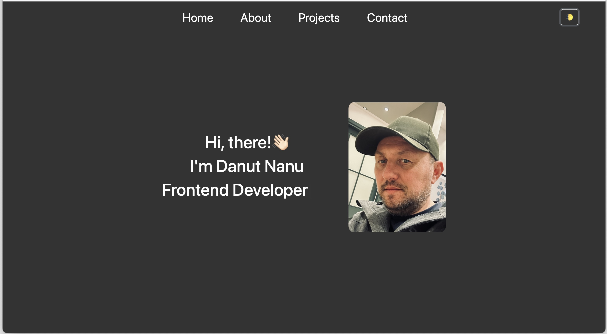

# React Portfolio

View the live site 
 
## Project Overview

This is a personal portfolio website built with React. It showcases my projects, skills, and experience in web development.

## Features

🌗  Dark/Light mode
📱  Responsive design
🎨  Smooth animations
🔗  Easy navigation

## Screenshots



## Technologies Used

- ⚛️ React
- 🎨 Bootstrap
- 🌟 FontAwesome


## How to Use

1. **Fork the Repository**: Click the "Fork" button at the top right of this repository to create your own copy.

2. **Clone Locally**: Clone the forked repository to your local machine using:
   ```bash
   git clone <your-forked-repo-url>
   ```

3. **Navigate to the Project Directory**: Change into the project directory:
   ```bash
   cd <project-directory>
   ```

4. **Install Dependencies**: Run the following command to install all necessary dependencies:
   ```bash
   npm install
   ```

5. **Start the Application**: Once the installation is complete, start the application with:
   ```bash
   npm run start
   ```

6. **View in Browser**: Open your browser and go to your localhost to see your project running.

## Contact

Feel free to reach out via [email](mailto:danutnanu@icloud.com) or [LinkedIn](https://www.linkedin.com/in/danut-nanu-7474b4267/).
